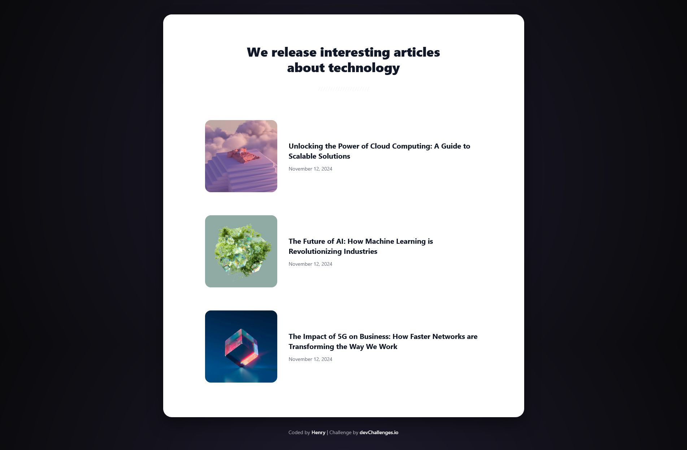

<h1 align="center">Simple Article Listing | devChallenges</h1>

<div align="center">
    Solution for a challenge <a href="https://devchallenges.io/challenge/simple-article-listing" target="_blank">Simple Article Listing</a> from <a href="http://devchallenges.io" target="_blank">devChallenges.io</a>.
</div>

<div align="center">
  <h3>
    <a href="https://henrydevlab.github.io/simple-article-listing/">
      Demo
    </a>
    <span> | </span>
    <a href="https://github.com/Henrydevlab/simple-article-listing">
      Solution
    </a>
    <span> | </span>
    <a href="https://devchallenges.io/challenge/simple-article-listing">
      Challenge
    </a>
  </h3>
</div>

## Table of Contents

- [Overview](#overview)
  - [What I learned](#what-i-learned)
  - [Useful resources](#useful-resources)
- [Built with](#built-with)
- [Features](#features)
- [Contact](#contact)
- [Acknowledgements](#acknowledgements)

## Overview



This project is a clean, modern article listing component designed to practice responsive layouts and interactive UI elements. It features a dark-themed background with high-contrast cards, ensuring readability and a premium aesthetic across all devices.

### What I learned

This challenge was a fantastic way to practice **Flexbox alignment** and **CSS transitions**. I specifically focused on:

- Implementing a "Mobile-First" workflow to ensure the layout stacks correctly on smaller screens.
- Using `flex-shrink: 0` on image containers to prevent thumbnails from distorting when titles are long.
- Creating smooth micro-interactions using `transform` and `cubic-bezier` timing functions.

**Code Highlight: Responsive Flex Toggle**
```css
.article {
    display: flex;
    align-items: center;
    gap: 32px;
}

@media (max-width: 600px) {
    .article {
        flex-direction: column; /* Vertical stack for mobile */
        align-items: flex-start;
    }
}
```

### Useful resources

- [CSS-Tricks: A Guide to Flexbox](https://css-tricks.com/snippets/css/a-guide-to-flexbox/) - This remains the ultimate reference for understanding how flex containers behave.
- [MDN Web Docs: Using CSS transitions](https://developer.mozilla.org/en-US/docs/Web/CSS/CSS_Transitions/Using_CSS_transitions) - Great for learning how to animate properties like `transform` and `color`.

### Built with

- Semantic HTML5 markup
- CSS custom properties (Variables)
- Flexbox
- Mobile-first workflow
- CSS Keyframe Animations

## Features

This application/site was created as a submission to a [DevChallenges](https://devchallenges.io/challenges-dashboard) challenge.

- **Responsive Layout:** Optimized for 412px (Mobile), 1024px (Tablet), and 1350px (Desktop).
- **Smooth Interactivity:** Hover effects including image scaling and text color shifts.
- **Modern UI:** Radial gradient backgrounds and 3D-styled tech assets.
- **Accessibility:** Semantic elements (`<article>`, `<time>`) used throughout for better SEO.

## Acknowledgements

- Design inspired by the devChallenges.io team.
- High-quality 3D renders provided by the challenge asset pack.

## Author

- GitHub [@Henrydevlab](https://github.com/Henrydevlab)